<picture>
  <source media="(prefers-color-scheme: dark)" srcset="./assets/profile-terminal-dark.svg">
  <source media="(prefers-color-scheme: light)" srcset="./assets/profile-terminal-light.svg">
  
</picture>

  profile picture → ASCII · public stats → GitHub API · refresh → every 6 hours in Eastern Time

  <a href="https://www.linkedin.com/in/erik-reilly/">linkedin</a>
  ·
  <a href="https://github.com/aerybyte?tab=repositories">projects</a>

<!--
Generated by .github/workflows/refresh-profile.yml.
Edit profile.yml to change the copy, birthday-based uptime, timezone, portrait behavior, or colors.
The workflow downloads the current GitHub avatar, caches it in assets/avatar.png,
and rebuilds the ASCII portrait and both SVG themes on its timezone-aware cron schedule.
Unchanged cron checks do not create commits.
-->
