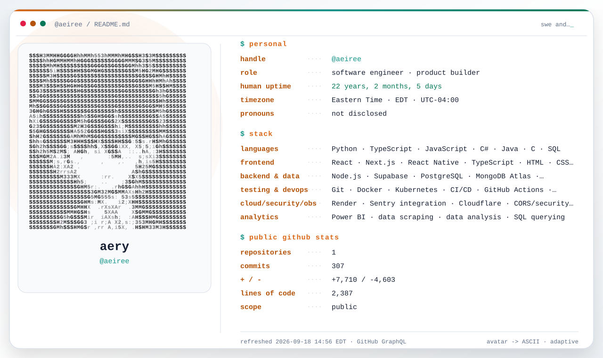

<picture>
  <source media="(prefers-color-scheme: dark)" srcset="./assets/profile-terminal-dark.svg">
  <source media="(prefers-color-scheme: light)" srcset="./assets/profile-terminal-light.svg">
  
</picture>

<details>
<summary>copyable text version</summary>

```text
+----------------------------------------------------------------------+
| [eri reilly]                                                         |
| role = software engineer                                             |
| focus = full-stack systems · applied ai · infrastructure             |
| education = rutgers university — cs + marketing                      |
| website = aeiree.com                                                 |
| discord = @aeiree                                                    |
| - - - - - - - - - - - - - - - - - - - - - - - - - - - - - - - - - -  |
| [top skills]                                                         |
| languages = typescript · python · javascript · sql                   |
| frontend = react · react native · vite · capacitor · next.js         |
| backend = node.js · postgresql · supabase · postgis · sqlite         |
| ai = rag · open webui · llm tool calling · nlp                       |
| infra = docker · kubernetes · gvisor · github actions · unifi        |
| testing = jest · supertest · playwright · appium                     |
| platforms = sap · firebase · github · gitlab · jira · new relic      |
| - - - - - - - - - - - - - - - - - - - - - - - - - - - - - - - - - -  |
| [current systems]                                                    |
| woe = sap-connected ordering · web / ios / android                   |
| wilbur = internal rag assistant · secure ai workbench                |
| atp = geospatial social platform · react native / postgis            |
| - - - - - - - - - - - - - - - - - - - - - - - - - - - - - - - - - -  |
| [public github stats]                                                |
| repositories = 1                                                     |
| commits = 323                                                        |
| + / - = +8,897 / -5,289                                              |
| lines of code = 81,165                                               |
| - - - - - - - - - - - - - - - - - - - - - - - - - - - - - - - - - -  |
| next scheduled slot = 2026-09-20 00:00 edt                           |
+----------------------------------------------------------------------+
```

</details>

<!-- Generated by scripts/build_profile.py -->
